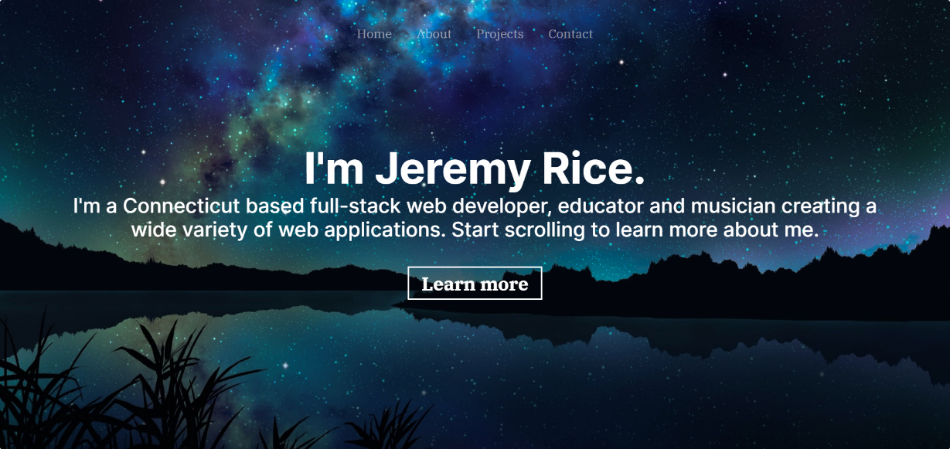

# React-Portfolio 

  
A collection of my professional coding projects, as well as some background and contact information about me.

[Link to published website](https://jeremyrice.gatsbyjs.io/)

## Table of Contents  
*   [Description](#Description) 
*   [Installation and Usage](#Installation-and-Usage)  
*   [Image of the app](#Image-of-the-app)
*   [Credits](#Credits)
*   [License](#License)  
*   [Contact](#Contact) 

## Description  

Personal website/contact page/portfolio with modern, responsive design. Uses the following technologies:

- [Gatsby](https://www.gatsbyjs.org/) - Static Site Generator
- [GraphQL](https://graphql.org/) - Query language for APIs
- [React](https://es.reactjs.org/) - Front-End JavaScript library
- [Bootstrap 4](https://getbootstrap.com/docs/4.3/getting-started/introduction/) - Front-End UI library
- [Sass](https://sass-lang.com/documentation) - CSS extension language

## Installation and Usage  

 There is nothing to install to view the contents of this website. 
  
## Image of the App   
  

 
## Credits

Thank you to [Jacobo Martinez](https://github.com/cobidev) for providing the original template for this site.  

## License  

MIT License

Copyright (c) 2021 Jeremy Rice

Permission is hereby granted, free of charge, to any person obtaining a copy
of this software and associated documentation files (the "Software"), to deal
in the Software without restriction, including without limitation the rights
to use, copy, modify, merge, publish, distribute, sublicense, and/or sell
copies of the Software, and to permit persons to whom the Software is
furnished to do so, subject to the following conditions:

The above copyright notice and this permission notice shall be included in all
copies or substantial portions of the Software.

THE SOFTWARE IS PROVIDED "AS IS", WITHOUT WARRANTY OF ANY KIND, EXPRESS OR
IMPLIED, INCLUDING BUT NOT LIMITED TO THE WARRANTIES OF MERCHANTABILITY,
FITNESS FOR A PARTICULAR PURPOSE AND NONINFRINGEMENT. IN NO EVENT SHALL THE
AUTHORS OR COPYRIGHT HOLDERS BE LIABLE FOR ANY CLAIM, DAMAGES OR OTHER
LIABILITY, WHETHER IN AN ACTION OF CONTRACT, TORT OR OTHERWISE, ARISING FROM,
OUT OF OR IN CONNECTION WITH THE SOFTWARE OR THE USE OR OTHER DEALINGS IN THE
SOFTWARE.
 
## Contact  
GitHub: 
[Jeremy Rice](https://github.com/jdavidrice)

Email:
jdavidrice@gmail.com

*   [Return to Top](#React-Portfolio)  
